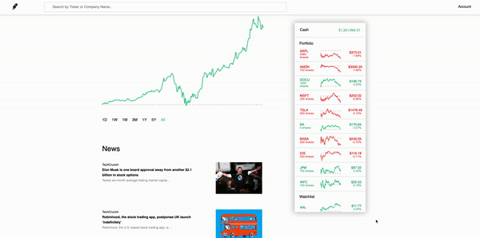
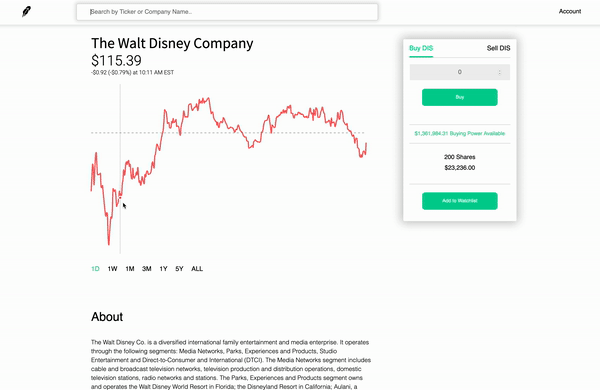

# LittleJohn
LittleJohn is a clone of Robinhood, which is  a commission-free investment platform.


[Live Demo](https://littlejohn-and-robinhood.herokuapp.com/)

## Technology
* Frontend: React, Redux
* Backend: Ruby on Rails, PostgreSQL, ActiveRecord
* API: News API, Yahoo Finance
* Charts: ReCharts

### User
* Allows users to sign up, sign in, and log out
* User dashboard shows market news and a list of stocks in the user's portfolio and watchlist

### Portfolio / Watchlist
* Lists real-time market value of the stocks the signed in user owns
* Lists real-time market value of the stocks the signed in user is watching
* Calculate price changes and color code accordingly

``` javascript
if (prevState.stock.info !== undefined && this.props.stock.info !== undefined) {
    let prevPrice = this.props.stock.info.regularMarketPreviousClose;
    let newPrice = this.props.stock.info.regularMarketPrice;
    let change = (prevPrice - newPrice) / prevPrice * 100;
    if (change > 0) {
        this.ticker = { 
            color: "price-green",
            change: change
            }
    } else {
        this.ticker = { 
            color: "price-red",
            change: change
            }
    }
}
```
<br>



### Stock 
* Show page provides a chart of the stock's 5 years of historical trade data, and its related news



### Search
* Allows users to search by either ticker name or company name, and opens the stock's show page
* Using address params, make api calls to fetch proper stock information

``` javascript
handleSubmit(e) {
    e.preventDefault();
    this.props.getStock(this.state.query)
    this.props.history.push(`/stocks/${this.state.query}`)
}
```
``` ruby
def show
    @stock = Stock.where(ticker: params[:ticker]).or(Stock.where("lower(name) like ?", "%#{params[:ticker]}%".downcase)).first
    ticker = @stock.ticker
    stock_url = "https://query1.finance.yahoo.com/v7/finance/quote?symbols=#{ticker}"
    @stock_info = HTTParty.get(stock_url).parsed_response["quoteResponse"]["result"][0]
    if @stock_info.nil?
        render json: ['Unable to fetch stock'], status: 401
    else
        render 'api/stocks/show';
    end
end
```

<br>


### Next Steps
* Implement Buy/Sell functionality
* Provide account summary/history on the dashboard


